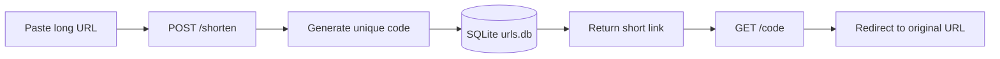

<div align="center">

# ⚡ LinkForge

### Turn giant URLs into tiny, shareable links.

**A sleek, minimal URL shortener powered by Flask + SQLite.**

<br />

[](https://www.python.org/)
[](https://flask.palletsprojects.com/)
[](https://www.sqlite.org/)
[](https://developer.mozilla.org/en-US/docs/Web/HTML)

<br />

[✨ Features](#-features) · [⚡ Quick start](#-quick-start) · [🔌 API](#-api) · [🗺️ Roadmap](#️-roadmap)

</div>

---

## 🎯 The idea

Long links are messy. LinkForge gives them a clean, memorable identity in one click:

```text
https://example.com/articles/how-to-build-a-project
                         ↓
http://localhost:5000/aB3xYz
```

No accounts. No complicated setup. Just paste, shorten, share.

## ✨ Features

| | Capability | What it does |
|---|---|---|
| 🚀 | **Instant shortening** | Creates a unique six-character code for every URL |
| 🧠 | **Smart protocol handling** | Adds `https://` when a protocol is not supplied |
| 🛡️ | **Safe database queries** | Uses SQLite parameterized queries for stored URLs |
| 🔁 | **Fast redirects** | Resolves a short code and redirects to the original URL |
| 🎨 | **Simple web UI** | A focused Flask template-based experience |
| 📦 | **Tiny footprint** | Only Flask is required to run the application |

## 🧰 Built with

- **Python** — application logic
- **Flask** — routes, forms, rendering, and responses
- **SQLite** — lightweight persistent URL storage
- **HTML** — frontend templates

## ⚡ Quick start

### 1. Clone

```bash
git clone https://github.com/vibecodersxdddddd/url-shortener-flasks.git
cd url-shortener-flasks
```

### 2. Create an isolated environment *(recommended)*

```bash
python -m venv .venv

# macOS / Linux
source .venv/bin/activate

# Windows PowerShell
.venv\Scripts\Activate.ps1
```

### 3. Install

```bash
pip install -r requirements.txt
```

### 4. Launch 🚀

```bash
python app.py
```

Open **[http://localhost:5000](http://localhost:5000)** and shorten your first link.

> The SQLite database (`urls.db`) is initialized automatically when the app starts.

## 🔌 API

### Create a short URL

The current app accepts a form submission at `POST /shorten`:

```bash
curl -X POST http://localhost:5000/shorten \
  -d "url=https://github.com/vibecodersxdddddd/url-shortener-flasks"
```

The response renders the home page with the generated short URL.

### Follow a short URL

```http
GET /<short_code>
```

Example:

```bash
curl -i http://localhost:5000/aB3xYz
```

A known code redirects to its original URL. Unknown codes return `404 URL not found`.

## 🧭 How it works



1. The form sends a URL to `/shorten`.
2. Missing protocols are normalized to `https://`.
3. A random six-character alphanumeric code is generated.
4. The URL and code are stored in SQLite.
5. Visiting the code looks up the destination and redirects.

## 🗂️ Project map

```text
url-shortener-flasks/
├── app.py              # Flask app, routes, code generation, SQLite logic
├── requirements.txt    # Runtime dependencies
├── templates/          # Jinja/HTML templates
├── static/             # Frontend assets
├── urls.db             # Runtime-created SQLite database
└── README.md           # You are here ✨
```

## 🧪 Try it manually

```bash
# Start the server
python app.py

# Create a link
curl -X POST http://127.0.0.1:5000/shorten \
  -d "url=github.com"

# Then open the generated link in your browser
```

## 🔐 Notes for production

This project is intentionally small and ideal for learning or local use. Before deploying publicly, consider:

- Run Flask with a production WSGI server instead of the development server.
- Set `debug=False` in production.
- Add stronger URL validation and abuse/rate-limit protection.
- Protect and back up `urls.db`.
- Add tests, structured error pages, and observability.
- Consider cryptographically secure code generation for higher-stakes deployments.

## 🗺️ Roadmap

- [ ] Custom aliases
- [ ] URL expiration
- [ ] Click analytics
- [ ] QR code generation
- [ ] JSON API responses
- [ ] Rate limiting and stronger validation
- [ ] Automated tests and CI
- [ ] Dark mode 🌙

## 🤝 Contributing

Have an upgrade idea? Contributions are welcome!

1. Fork the project.
2. Create a branch: `git checkout -b feature/my-upgrade`
3. Make your change and test it locally.
4. Commit: `git commit -m "Add my upgrade"`
5. Push and open a pull request.

Please keep changes focused and document new behavior in the README.

## 📄 License

No license file is currently included in the repository. Add a `LICENSE` file before distributing the project under a specific open-source license.

## 🌟 Support the project

If LinkForge helped you learn something, **star the repo**, open an issue, or submit an improvement:

- [⭐ Star on GitHub](https://github.com/vibecodersxdddddd/url-shortener-flasks)
- [🐛 Report an issue](https://github.com/vibecodersxdddddd/url-shortener-flasks/issues)

<div align="center">

<br />

**Made with Python, Flask, and an unreasonable love of tiny links.** 🔗⚡

</div>
